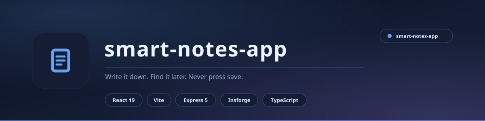

<div align="center">

<picture>
  <source media="(prefers-color-scheme: light)" srcset="docs/assets/banner-light.svg">
  <source media="(prefers-color-scheme: dark)" srcset="docs/assets/banner.svg">
  
</picture>

<br>

**Write it down. Find it later. Never press save.**

A full-stack notes app built as a pnpm monorepo - a React + Vite front end over a shared Express backend, with the API contract generated from an OpenAPI spec so the two can never drift apart.

<br>


<br>

[**Features**](#features) &nbsp;&nbsp;|&nbsp;&nbsp; [**Architecture**](#architecture) &nbsp;&nbsp;|&nbsp;&nbsp; [**Running it**](#running-it) &nbsp;&nbsp;|&nbsp;&nbsp; [**API**](#api)

</div>

---

## What it is

This repository is the **original build** of Smart Notes: a landing page plus a working notes workspace, backed by an Express server and persisted to Insforge.

It is deliberately smaller than its sibling, [smart-ins-note](https://github.com/aizenrexx/smart-ins-note). That one grew a Next.js three-panel workspace, a rich-text editor and an AI assistant. This one is the foundation - the monorepo shape, the generated API client, and the CRUD flow that everything else was built on top of.

> If you only want to run one of them, run **smart-ins-note**. This repo is kept because the architecture here is the simpler thing to read when you want to understand how the pieces fit.

<div align="center">

|  |  |
|:---|:---|
| **Front end** | React 19 + Vite, TailwindCSS |
| **Backend** | Express 5 - every data call goes through it |
| **Persistence** | Insforge (cloud Postgres-compatible BaaS) |
| **Validation** | Zod, OpenAPI-generated schemas |
| **Monorepo** | pnpm workspaces, Node 24, TypeScript 5.8 |

</div>

---

## Features

- **Landing page** - hero, features, how-it-works, call to action
- **Notes workspace** - create, read, update and delete notes with real-time updates
- **Starred, archived and trashed** states rather than a flat list
- **Tags** with colour, created and deleted from the UI
- **Search** across titles and content
- **Dark and light mode**
- **OpenAPI-driven API client** - change the spec, regenerate, and the hooks and validators follow

---

## Architecture

```
artifacts/
  smart-notes/         React 19 + Vite front end   (/)
  api-server/          Express 5                   (/api)
  mockup-sandbox/      Vite component preview      (/__mockup)
lib/
  api-spec/            OpenAPI spec (source of truth)
  api-zod/             Generated Zod schemas
  api-client-react/    Generated React Query hooks
```

The browser never talks to the database. Every request goes through Express, which keeps the backend credentials on the server where they belong.

---

## Running it

```bash
# install
pnpm install

# regenerate hooks and validators from the OpenAPI spec
pnpm --filter @workspace/api-spec run codegen

# API server
pnpm --filter @workspace/api-server run dev

# front end
pnpm --filter @workspace/smart-notes run dev

# typecheck everything
pnpm run typecheck
```

### Environment

| Variable | Purpose |
|:---|:---|
| `INSFORGE_API_BASE_URL` | Insforge project base URL |
| `INSFORGE_API_KEY` | Insforge API key - server-side only |
| `INSFORGE_ANON_KEY` | Insforge anon JWT |
| `SESSION_SECRET` | Session secret |

> Keep these in `.env` (git-ignored). Never commit a real key.

---

## API

| Method | Path | Purpose |
|:---|:---|:---|
| `GET` | `/api/healthz` | Health check |
| `GET` | `/api/notes` | List notes, newest first |
| `POST` | `/api/notes` | Create `{ title, content }` |
| `PATCH` | `/api/notes/:id` | Update `{ title?, content?, starred?, archived?, trashed? }` |
| `DELETE` | `/api/notes/:id` | Delete a note |
| `GET` `POST` | `/api/tags` | List / create tags |
| `DELETE` | `/api/tags/:id` | Delete a tag |

---

## Data model

| Table | Columns |
|:---|:---|
| `notes` | id, title, content, starred, archived, trashed, created_at, updated_at |
| `tags` | id, name, color, created_at, updated_at |

---

## Licence

MIT - see [LICENSE](LICENSE).

Built by **Aizenrex x Riyad**.
